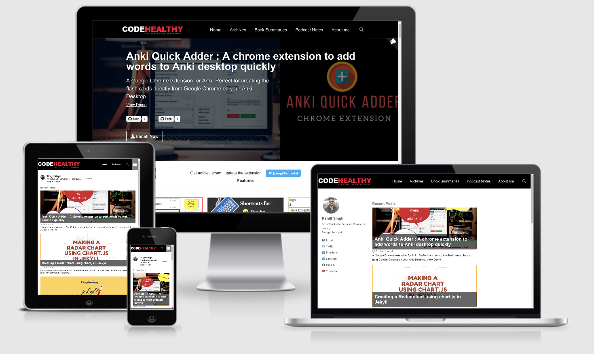

# Codehealthy blog

This is the source code for my personal blog at [codehealthy.com](http://codehealthy.com) built on jekyll using minimal-mistake theme.

## Screenshot

## Getting Started

The documentation is detailed here at [minimal-mistake documentation](https://github.com/mmistakes/minimal-mistakes/)

### ChangeLog
        
        0.0.1
        + Individual default falback thumbnails for each category
        + Book review collection
        + podcast Notes collection

## Automatic Deployment Script

Script to automate deployment on linux can be [downloaded here.](https://codehealthy.com/jekyll-automatic-deployment-ftp/)
## Built With

* [jekyll](https://jekyllrb.com/) - The static site generator
* [minimal-mistakes](https://github.com/mmistakes/minimal-mistakes) - minimal-mistake theme

## License
This project is licensed under the MIT License - see the [LICENSE.md](LICENSE) file for details.

